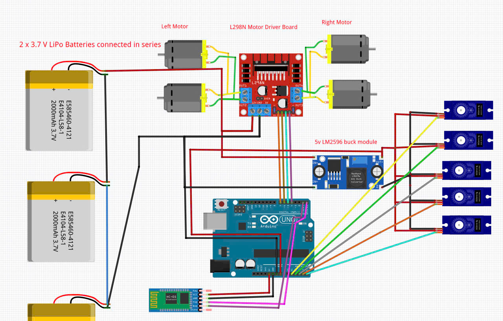

# robot-arm-car
Đây là dự án mã nguồn mở điều khiển robot đa năng (xe + cánh tay robot) sử dụng tay cầm PS2 không dây. Dự án này hỗ trợ điều khiển xe di chuyển linh hoạt, vận hành cánh tay cơ khí và cơ chế kẹp (gripper).

## 📋 Tính năng 
- Điều khiển xe: Tiến, lùi, rẽ trái/phải và xoay tại chỗ với tốc độ tùy chỉnh.

- Điều khiển cánh tay: Sử dụng Joystick của tay cầm PS2 để điều khiển 2 khớp cánh tay chính và 1 servo trung tâm.

- Cơ chế bổ sung: Tích hợp điều khiển kẹp (Grip) và cơ chế cờ (Flag) linh hoạt.

- Đa nền tảng: Code được tối ưu cho cả dòng Arduino (Uno/Nano/Mega) và ESP32.
## 🛠 Phần cứng yêu cầu
- Vi điều khiển: Arduino (Uno/Nano/Mega) hoặc ESP32.

- Tay cầm(thay thế cho hc-05): Bộ điều khiển PS2 (không dây) + Bộ thu (Receiver).

- Động cơ: 2 Động cơ DC + Driver cầu H (L298N/L293D).

- Servo: 5 động cơ Servo (SG90/MG996R) cho các khớp cánh tay, kẹp và cờ.

- Nguồn: Pin Li-po 7.4V hoặc nguồn rời cho động cơ để đảm bảo hiệu suất.

## 🔌 Sơ đồ kết nối nhanh (Arduino)
** lưu ý **: là sơ đồ này ban đầu mình dùng hc-05 nhưng sau đó mình đổi sang tay cầm ps2 nên code mình cũng có đổi.

| Chức năng | Chân (Pin) |
| :---: | :---: |
| **PS2 CLK** | 13 |
| **PS2 CMD** | 11 |
| **PS2 SEL** | 12 |
| **PS2 DAT** | 10 |
| **Motor DC (L/R)** | 4, 5, 6, 7 |
| **Servo (Grip/Arm/Flag)** | A0, A1, A2, A3, A4 |

## 🚀 Hướng dẫn cài đặt

- **Thư viện:** Cài đặt các thư viện sau từ Arduino Library Manager:
  - `PS2X_lib` (phiên bản 1.6 trở lên).
  - `Servo` (thư viện chuẩn).
- **Code:** Nạp file `.ino` vào vi điều khiển bằng Arduino IDE.
- **Kiểm tra:** Mở *Serial Monitor* với baudrate `115200` để theo dõi trạng thái kết nối tay cầm.

## 🎮 Điều khiển

- **D-Pad (Up/Down):** Di chuyển tiến/lùi.
- **Joystick (Right/Left):** Xoay trái/phải hoặc rẽ.
- **Nút Triangle:** Đóng/mở kẹp.
- **Nút Cross:** Kích hoạt cơ chế cờ (Flag).
- **Joystick (Analog):** Điều khiển các khớp cánh tay và servo trung tâm.
## kết quả
<video src="" width="100%" controls></video>

